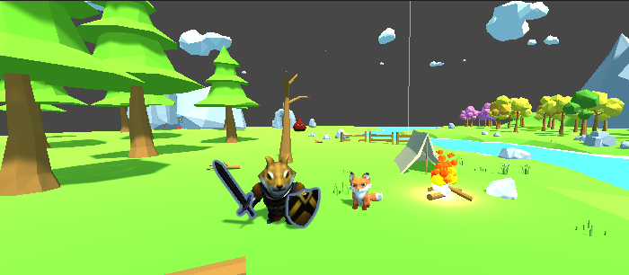

# The Dog Knight

3D Infinite Runner Game build with the Unity Game Engine and C# Programming Language.

## Built With

- Unity Game Engine
- C# for the scripts

### C# Libraries

- System.Collections
- System.Collections.Generic
- UnityEngine
- UnityEngine.UI
- UnityEngine.SceneManagement

## Author

- 👤GitHub: [Jose Abel Ramirez](https://github.com/jose-Abel)
- Linkedin: [Jose Abel Ramirez Frontany](https://www.linkedin.com/in/jose-abel-ramirez-frontany-7674a842/)

## Getting Started

To download the project either can do it with with git clone command:

git clone <repository_link>

## Live version

- Build folder has the Linux build for the game

- WebGL folder has the website build

[demo version](https://play.unity.com/mg/other/the-dog-knight)

## Show your support

Give a ⭐️ if you like this project!
